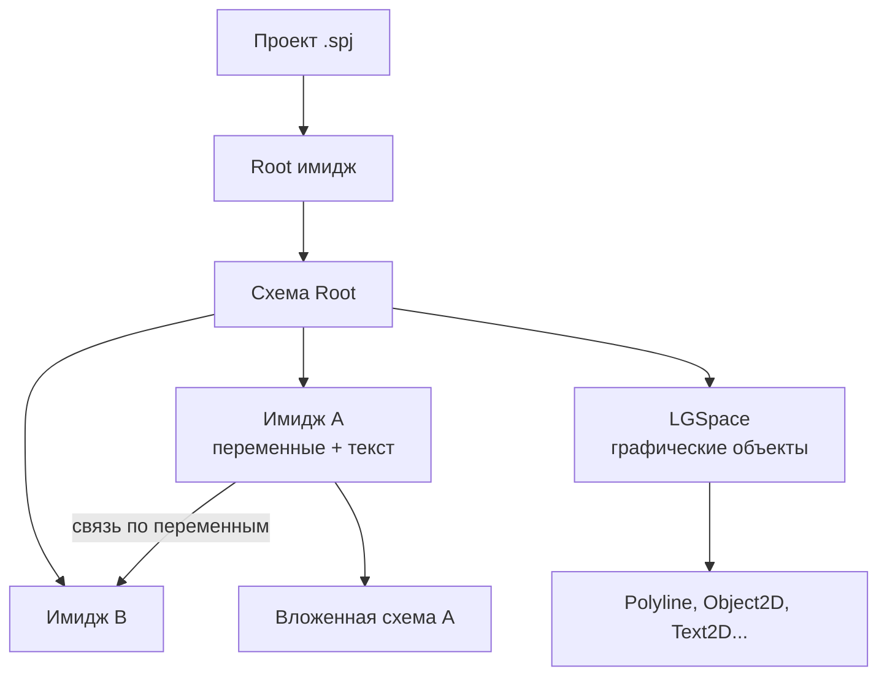
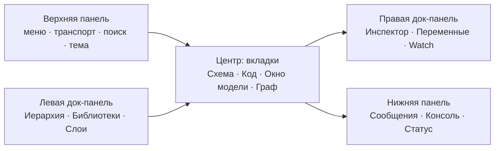
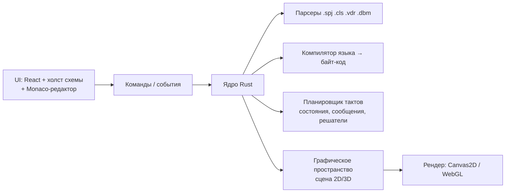

# ТЗ: Stratum Modern

2026-09-17 · @Someone

Техническое задание на современную реимплементацию среды визуального программирования Stratum 2000 (ПРОФИ). Предназначено как стартовый промпт-документ для нового чата Claude Code.

## 1. Цель и контекст

Нужно построить **Stratum Modern** — современную кроссплатформенную реимплементацию среды визуального моделирования Stratum 2000 (v3.01 «ПРОФИ», Пермский ГТУ, авторы О. И. Мухин, В. А. Носков, А. А. Шелемехов) с функциональностью не меньше оригинала и заметно лучшим интерфейсом. Проект личный, некоммерческий, без цели продажи.

**Что такое Stratum 2000.** Интегрированная среда для имитационного и математического моделирования: пользователь собирает модель из блоков-«имиджей» на схеме, соединяет их связями по переменным, описывает поведение каждого блока на простом математическом языке, и среда исполняет модель по тактам с 2D/3D-визуализацией. Оригинал — Win32-приложение 1998–2013 гг. (SC200032.EXE + \~40 DLL: Direct3D9, OpenGL, OGRE 1.7, Cairo, IDAPI для БД), исходников нет, работает у пользователя через Wine на Ubuntu.

**Почему переделываем.** Интерфейс уровня Windows 95 (собственная отрисовка через GDI, MDI-окна, WinHelp), нестабилен в Wine (зависания при долгих симуляциях, потеря фокуса, невидимые выпадающие меню), нет тёмной темы, масштабирования, автодополнения, современного редактора кода и удобной навигации по иерархии.

**Для кого.** Один пользователь-студент (учебный курс «УИРС», проекты вроде «Солнечная система», см. папку `Загрузки/артем (1)/уирс/`), плюс потенциально другие студенты, изучающие моделирование по учебникам Мухина.

**Целевой результат.** Десктопное приложение, которое: открывает существующие проекты `.spj/.cls` без правок; даёт тот же язык и ту же стандартную библиотеку; исполняет модель детерминированно как оригинал; и при этом выглядит и ощущается как современный инструмент 2026 года (см. разделы 6–7).

**Границы (не делаем в v1).** Сетевые функции Windows Sockets, OLE2-мост, IDAPI-базы данных, плагины SMS/SendMail/TextAnalyser, видео через Video for Windows — переносятся во «второй этап» с заглушками, чтобы старые проекты хотя бы открывались.

## 2. Ключевые понятия и модель данных

Ядро Stratum — дерево имиджей, где каждый имидж = переменные + текст на языке моделирования + (опционально) вложенная схема из других имиджей. Термины ниже взяты из справки `SC3.HLP` (раздел «Основные термины и определения») и должны использоваться в UI и коде под теми же именами.

| Термин (рус / англ) | Что это | Требования к реализации |
| --- | --- | --- |
| Проект (Project) | Файл `project.spj` + набор `.cls` в одной папке. Корневой имидж `Root_xxxx`. | Открытие/сохранение папки как единицы; недавние проекты; «Сохранить проект как» копирует всю папку |
| Имидж (Class) | Класс-блок: имя, переменные, текст (код), иконка, вложенная схема, гипербаза. Уникальное имя вида `StratumClass_a3a12d_1e` или пользовательское (`день`, `Button`) | Один `.cls` на имидж; библиотечные имиджи read-only; экземпляр на схеме ссылается на класс по имени |
| Схема (Scheme) | Холст внутри имиджа: экземпляры дочерних имиджей, связи, графические объекты, контактные площадки. Лист имеет параметры (размер, фон, сетка) | Бесконечный холст с зумом/панорамой; сетка; листы |
| Переменные (Vars) | Поля имиджа. Типы: `FLOAT` (по умолчанию), `STRING`, `HANDLE`, `COLORREF`, `INTEGER`, `WORD`, `BYTE`, `POINTER`. Модификаторы: интерфейсная (видна снаружи), `local`, значение по умолчанию, описание | Таблица переменных с типом, значением, «по умолчанию», описанием (как вкладка «Переменные» диалога имиджа) |
| Связь (Link) | Соединение переменных двух имиджей на схеме (1:1, 1:M, M:1). Свойства: вершины линии, стиль, цвет | Провода с автотрассировкой и ручными вершинами; валидация типов |
| Контактная площадка (Contact place) | Точка на границе имиджа, через которую наружу выведена переменная | Порты у иконки блока; drag-connect |
| Порядок вычисления (Calculate order) | Явно задаваемый порядок обхода имиджей в такте («Редактировать порядок вычислений») | Список с перетаскиванием + авто по графу зависимостей |
| Состояние (State) | Значения всех переменных на такте; `~x` = текущее, `x` = новое | Хранить два буфера значений на переменную |
| Сообщение (Message) | Событие (WM\_xxx, мышь, таймер, свои) доставляется имиджу; обработка по значению переменной `msg` | Очередь сообщений; `SendMessage`, `RegisterObject` |
| Графическое пространство (Graphic space) | 2D/3D-холст (`LGSpace`, окно), в котором живут графические объекты с `HANDLE` | Отдельный слой рендера, не смешивать со схемой |
| Графические объекты | Line, Polyline, Rectangle, Ellipse, Text, Bitmap (`.dbm`/`.bmp`), Group, Pen, Brush, Font, DIB; 3D: Sphere, Bar, Cylinder, Tube, Tore, Grid, Camera, Light | Полный набор + свойства как в диалогах «Свойства графического/трёхмерного объекта» |
| Дескриптор (Descriptor / HANDLE) | Целочисленный идентификатор объекта/окна/потока, литерал `#0`, `#175` | Тип HANDLE, литерал `#N` |
| Слои (Layers) | Номер слоя объекта на схеме (0–31), видимость по слоям | Панель слоёв |
| Z-порядок (Z-order) | Порядок наложения графических объектов («На верх», «Назад», «На одну…») | Команды + список |
| Окно (Window) | Окно графического пространства (`Main Window`, дочерние) с именем и свойствами (`GetWindowProp`) | Вкладки/док-панели вместо MDI |
| Библиотека имиджей (Library) | Папки `.LIB`/`.SC` с `.cls` + `.tdl` (описатели DLL-функций) + `.vdr` (иконки-векторы) | Панель «Библиотеки» с поиском и превью |
| Гиперпроект / Гипербаза | Ссылки между проектами (`Открыть ссылку`, `.url`), встроенная БД имиджа | Вкладка «Гипербаза» сохраняется, функции — этап 2 |



Чтение: проект — дерево имиджей; каждый имидж может содержать свою схему, а графика живёт отдельно в графическом пространстве и управляется из кода имиджей по дескрипторам.

## 3. Язык моделирования Stratum

Язык — простой императивный, регистронезависимый, без точек с запятой на конце строки; текст имиджа исполняется целиком каждый такт. Всё ниже восстановлено из текстов \~150 библиотечных `.cls` (70 000 строк) и оглавления справки; точные сигнатуры всех функций нужно снять из `help/SC3.HLP` декомпилятором WinHelp (`helpdeco`) на первом этапе.

### 3.1 Модель исполнения

- Симуляция идёт тактами («цикл и такт»). В такте имиджи обходятся в порядке вычисления, текст каждого выполняется сверху вниз.
- `~x` — значение переменной на начало такта («старое»), `x` в правой части — уже вычисленное новое; `x := …` пишет новое. Пример из проекта: `t := t+h` и `xE := x0 + rE1 * sin(t)`.
- Связь переменных означает общую ячейку: запись в одном имидже видна в другом.
- `exit()` прерывает текст имиджа в текущем такте.
- Сообщения: переменная `msg` получает код (`WM_LBUTTONDOWN`, `WM_MOUSEMOVE`, `WM_ALLMOUSEMESSAGE`, `WM_CHAR`, таймер, пользовательские), координаты — `xPos`, `yPos`, клавиши — `fwKeys`. Подписка — `RegisterObject(hSpace, hObj, className, msgMask, flags)`.
- Переменные со значением по умолчанию и системные (`WindowName`, `HSpace`, `msg`, `xPos`, `yPos`, `_hObject`).
- Уравнения (раздел «Уравнения» справки): встроенные решатели выбираются в настройках: дифференциальные — Эйлер, линейные — Гаусс, нелинейные — Ньютон–Рафсон (из `control.dsk`). В тексте уравнение записывается через `=` (а не `:=`), среда решает его относительно неизвестной — уточнить семантику по справке.

### 3.2 Синтаксис

| Элемент | Форма | Пример из библиотеки |
| --- | --- | --- |
| Объявление | `ТИП [local] имя, имя` | `FLOAT local xPos,yPos,msg` / `STRING WindowName` / `HANDLE HSpace` |
| Присваивание | `x := выражение` | `Width := GetObjectWidth2d(~HSpace, ~HObject)` |
| Старое значение | `~x` | `if (~HObject == #0)` |
| Разделитель операторов | перевод строки или `;` | `case (~j==1); fg := ~fg2; sg := "g2"` |
| Комментарий | `// …` | `// RegisterObject(…)` |
| Числа | `12`, `0.4`, `1e3` | `sin(1.6*t)` |
| Строки | `"текст"`, конкатенация `+` | `AddSlash(GetClassDirectory(…))+GetClassName("")+".vdr"` |
| Дескрипторы | `#0`, `#175` | `HSpace := #0` |
| Сравнение | `== != < <= > >=` | `while (~j <= 4)` |
| Логика | `&&`, `\|\|`, `!`, `not()`, `and()`, `or()` | `if (WindowName != "" && (~HSpace==#0))` |
| Арифметика | `+ - * / ^` и битовые `\| &` | `WM_ALLMOUSEMESSAGE, 1 \| 256` |
| Условие | `if (усл) … else … endif` | 1 773 вхождения в библиотеке |
| Выбор | `switch / case (усл); … / default / endswitch` | см. пример ниже |
| Циклы | `while (усл) … endwhile`; `for i := a, b … next`; `do … until (усл)`; `repeat` | `do … until (~xpos)` |
| Функции пользователя | `function` … `return` (в отдельном имидже, вызов по имени) | библиотека `FUNCTION.LIB` |
| Ссылки на имиджи | `GetClassName("")` — себя, `".."` — родитель, `GetVarF/GetVarH/SetVar` — доступ к чужим переменным по имени |  |
| Внешние DLL | файл `.tdl`: `DLL "sc_net32.dll" 32` / `name "F" arg "HANDLE","FLOAT" ret "HANDLE"` | `library/3DTOOLS.TDL` |

Пример реального кода (кнопка из `CONTROLS.LIB`):

```
STRING WindowName
HANDLE HSpace
FLOAT local xPos,yPos,msg,fwKeys,sizex,sizey
FLOAT pressed,ButtonUp,ButtonDown
if (not(~HObject))
 if (WindowName != "" && (~HSpace==#0));  HSpace := GetWindowSpace(~WindowName); endif
 if (not(~HSpace)); exit(); endif
 HObject := CreateObjectFromFile2D(~HSpace, AddSlash(GetClassDirectory(GetClassName("")))+GetClassName("")+".vdr", OrgX, OrgY, PFC_MOVEOBJECT)
 registerobject(~HSpace,~HObject,"",WM_ALLMOUSEMESSAGE,1 | 256)
endif
switch
  case (~msg == WM_LBUTTONDOWN); pressed := 1
  case (~msg == WM_LBUTTONUP);   pressed := 0
  default; 
endswitch
```

### 3.3 Типы и константы

- Типы: `FLOAT` (double, 4 679 объявлений в библиотеке), `HANDLE` (852), `STRING` (482), `COLORREF` (165), редкие `INTEGER`, `WORD`, `BYTE`, `POINTER`. Истина = любое ненулевое FLOAT.
- Группы констант (из справки): стили MessageBox, атрибуты показа окон, стили окна, заливки (BrushStyle), штриховки (Hatch), линий (PenStyle), растровых операций (ROP), ширины потока, стили Button/ComboBox/Edit/ListBox/ScrollBar, типы графических объектов, `WM_XXX`, уведомления от controls. Значения совпадают с Win32 API (`WM_LBUTTONDOWN = 0x201` и т. д.), `PFC_MOVEOBJECT` и прочие собственные — снять из справки.

### 3.4 Встроенные функции — группы и самые частые

В библиотеке встречается 581 различное имя функции. Справка делит их на 19 групп; реализовать нужно все, приоритет — по частоте использования.

| Группа (по справке) | Примеры функций (частота в библиотеке) |
| --- | --- |
| Математические | `sin` 102, `cos` 95, `abs` 57, `rnd` 38, `trunc` 24, `sqrt` 22, `round` 12, `sqr`, `max`, `min`, `exp`, `ln`, `atan` |
| Преобразование типов | `string` 115, `float` 54, `FLOAT` 57, `Handle`, `chr` 23, `Ie` |
| Строки | `length` 15, `substr`, `pos`, `upper`, `lower`, `AddSlash` 21 |
| Матрицы | `mcreate` 25, `Mput` 116, `MGet` 20, `mdelete`, `mrows`, `mcols` |
| Динамические массивы | `vgetf` 52, `vset` 8, `vinsert` 9, `vcreate`, `vsize`, `vdelete` |
| Системные | `exit` 182, `LogMessage` 19, `SetStatusText` 9, `GetTickCount`, `Sleep` |
| Файлы и папки | `GetClassDirectory` 17, `FileExists`, `OpenFile`, потоки `CreateStream`, `Read/Write` |
| Имиджи | `GetClassName` 66, `GetVarF` 14, `GetVarH` 16, `SetVar` 11, `GetHObject` 10, `CreateObject`, `DeleteObject` |
| 2D-графика | `GetObject2dByName` 116, `SetBitmapSrcRect2d` 63, `GetWindowSpace` 63, `SetPenColor2d` 51, `SetObjectOrg2d` 51, `SetVectorPoint2d` 50, `GetObjectOrg2dx/y` 36, `SetObjectSize2d` 36, `GetZOrder2d` 35, `CreatePolyLine2d` 17, `CreateGroup2d` 22, `AddGroupItem2d` 23, `DeleteObject2d` 23, `SetText2d` 22, `CreateObjectFromFile2D` 21, `CreateDib2D`, `CreateBitmap2D`, `CreatePen2d` 15, `CreateFont2D` 10, `RotateObject2d` 8, `SetScaleSpace2d` 8, `GetObjectFromPoint2d` 14, `SetZOrder2d` 13, `ObjectToTop2d` 16 |
| Цвет | `rgb/RGB` 147, `GetRValue/GetGValue/GetBValue` 25 |
| 3D-графика (старый sc3d) | `MakeBar3d` 17, `MakeCylinder3d` 12, `MakeSphere3d`, `MakeTube3d`, `MakeTore3d`, `MakeGrid3d`, `CreateCamera3dEx`, `SetObjectBase3d` 15, `PushCrdSystem3d/PopCrdSystem3d` 12, `SelectLocalCrd3d` 12, `_MoveObjectPoints3d` 8 |
| Ogre 3D | `RenderWindow_GetPrimary` 15, `ManualObject_Index` 12, `Movable_SetParent` 8, `StringInterface_SetParameter` 15 — обёртка над OGRE 1.7 (`OgreWrapper.dll`) |
| Окна | `GetWindowName` 38, `GetWindowProp` 27, `GetClientWidth/Height` 23, `SetWindowOrg` 15, `ShowWindow` 12, `SetClientSize` 11, `CreateWindow`, `CloseWindow` |
| Сообщения | `SendMessage` 50, `RegisterObject` 91, `SetCapture/ReleaseCapture` 17, `PostMessage` |
| Стандартные диалоги | `MessageBox`, `OpenFileDialog`, `SaveFileDialog`, `ChooseColor` |
| Интерфейсные элементы | `SetControlText2d` 13, `CreateControlObject2d`, `GetControlText2d` |
| Мультимедиа | `SndPlaySound` 9, `MCISendString` 12 |
| Базы данных, Сеть, TextAnalyser, DLL | этап 2; сигнатуры из `.tdl` и справки |

Требование: интерпретатор должен пройти все \~150 библиотечных имиджей и 45 примеров из `PROJECTS/samples` без ошибок разбора — это готовый тестовый корпус.

## 4. Функциональные требования

Принцип: каждая возможность оригинала сохраняется, но получает современную форму (столбец «Стало»). Приоритет: P1 — без этого нельзя открыть и запустить учебный проект; P2 — полная работа в редакторе; P3 — редкие подсистемы.

### 4.1 Проект и файлы (P1)

| Было (меню «Файл») | Стало |
| --- | --- |
| Новый ▸ проект/имидж; Открыть; Открыть ссылку (.url) | Экран приветствия: недавние, шаблоны, примеры из `PROJECTS/samples`; drag-and-drop папки |
| Сохранить все (F11); Сохранить проект как; Сохранить/как (имидж) | Автосохранение + история версий (снимки папки), Ctrl+S; индикатор несохранённых имиджей |
| Закрыть проект; список 7 недавних | Неограниченный список недавних с превью-картинкой схемы |
| Печать; Параметры печати; Экспорт (JPG, GIF, PCX, BMP, TGA, ICO, WMF) | Экспорт PNG/SVG/PDF схемы и окна; запись видео/GIF симуляции (замена `WRITEAVI`) |
| Файлы `.spj`, `.cls`, `.stt`, `.vdr`, `.dbm`, `.tdl` | Чтение всех старых форматов; запись в новый текстовый формат + экспорт в старый (раздел 8) |

### 4.2 Редактор схемы (P1)

- Холст с панорамой (Space+drag, средняя кнопка), зум колесом 10–800% к курсору, мини-карта, «показать всё» (в оригинале — комбобокс процентов и лупа).
- Объекты схемы: экземпляр имиджа (иконка + порты), связь, контактная площадка, графические примитивы (линия, полилиния, прямоугольник, эллипс, текст «A», растр, группа «G») — как на панели «Рисование».
- Выделение: клик, рамка, Shift/Ctrl, Ctrl+A; выделение из иерархии подсвечивает на холсте и наоборот (в оригинале не синхронизировано — основная боль).
- Правка: перемещение с прилипанием к сетке, ресайз за ручки, поворот, выравнивание/распределение, Z-порядок, слои 0–31, группировка/разгруппировка, дублирование Ctrl+D, буфер обмена и «Специальная вставка», удаление Delete — обязательно работает и с холста, и из иерархии.
- Неограниченный Undo/Redo с историей (оригинал: Отмена Shift+Alt+BkSp / Повтор Alt+BkSp).
- Связи: тянем от порта к порту, автороутинг ортогональный/прямой, вершины правятся, диалог «Параметры связи» (какие переменные соединены), подсветка ошибок типов.
- Вставка имиджа из библиотеки — палитра с поиском (Ctrl+K), перетаскивание на холст.
- «Создать схему» внутри имиджа, вход внутрь двойным кликом, хлебные крошки `Root › Солнце › Орбита`.
- Параметры листа: размер, фон, сетка, единицы.

### 4.3 Редактор имиджа (P1)

- Вкладки как в диалоге «Свойства имиджа»: Основное (имя, описание, библиотека), Переменные (таблица: имя, тип, данные, по умолчанию, описание, флаг контактной площадки), Текст (код), Иконка, Объект (X, Y, слой, имя экземпляра, HANDLE), Гипербаза — но как боковая панель-инспектор, а не модальный диалог.
- Редактор кода (в оригинале `use_syntax_edit`, `syntax_scheme Auto`): подсветка, автодополнение переменных и 581 функции с подсказкой сигнатуры, ошибки в строке до запуска, переход к определению переменной, поиск/замена Ctrl+F/Ctrl+R, автоотступ блоков `if/endif`.
- Компиляция при сохранении с панелью «Сообщения» (клик по ошибке → строка).
- Редактор иконки: векторная (`.vdr`) или растровая (`.dbm` 32×32, «Битовый редактор») — в v1 импорт PNG/SVG + простой пиксельный редактор; база иконок `data/ICONS/*.DBM` конвертируется в PNG-набор.

### 4.4 Моделирование (P1)

- Транспорт как на панели «Управление»: Пуск, Пауза, Шаг (один такт), До конца, Стоп/Сброс; шаг назад по истории состояний (кольцевой буфер N тактов).
- Скорость: тактов/с или «как можно быстрее», реальное время; счётчик тактов и модельного времени в статусе (оригинал: «Выполнение/Пауза» + число справа).
- Настройки проекта: шаг `h`, решатели уравнений, порядок вычислений, что запускать при старте (`OnStartup`).
- Живое редактирование: изменение кода и связей на паузе без перезапуска (в оригинале есть — «Изменения модели на ходу»).
- Защита от зависания: лимит точек полилиний/шлейфов, лимит времени такта, симуляция в отдельном потоке — UI никогда не блокируется.

### 4.5 Отладка (P2)

- Окно «Просмотр переменных» (Watch): живые значения любых переменных, редактирование на паузе, график значения за последние N тактов.
- «Информация о переменной» по наведению на порт.
- Точки останова по условию (`x > 100`), пауза при ошибке времени выполнения с подсветкой строки и имиджа.
- Панель «Сообщения»: компиляция, `LogMessage`, системные; фильтр и поиск.
- Граф зависимостей переменных (в справке — «Граф зависимостей») как отдельная вкладка.
- Профиль: время каждого имиджа за такт (`status_perfomance`).

### 4.6 2D-графика и окна (P1)

- Графическое пространство с полным API раздела 3.4: создание/удаление объектов из кода, перья, кисти, шрифты, растры (DIB, частичный показ `SetBitmapSrcRect2d`), группы, Z-порядок, поворот, масштаб пространства, hit-test `GetObjectFromPoint2d`, растровые операции, прозрачность (пример `transparent_rotate_raster`), доступ к пикселям (`PixelAccess`).
- Свойства объекта в инспекторе: Положение (X, Y, ширина, высота, угол, имя, слой, «невыбираемый»), Линия (стиль, цвет, толщина, ROP, стрелки), Заливка, Точки (таблица вершин), Гипербаза, Инфо.
- Окна модели (`Main Window` и дочерние, стили окон, `WindowRegion`) — вкладки или отдельные окна ОС по выбору; полноэкранный «режим презентации» без IDE-хрома.
- Интерфейсные элементы внутри окна модели: Button, Edit, ListBox, ComboBox, ScrollBar, CheckBox, Radio, Lamp, Gauge, Slider, NumberView (библиотека `CONTROLS.LIB`).

### 4.7 3D-графика (P3)

- Старый движок `sc3d` (Z-buffer, примитивы Bar/Sphere/Cylinder/Tube/Tore/Grid/Cone/Pyramid, камера, материалы, системы координат push/pop, импорт 3DS, `.v3d`) — реализовать на WebGL/wgpu по той же сигнатуре функций.
- Ogre3D-обёртка (примеры `Ogre_3D`, `CHOPPER.3D`) — заглушки в v1, полноценно — этап 3.
- Трёхмерный графический редактор (панели «Трёхмерная графика», «Трёхмерные примитивы») — этап 3.

### 4.8 Библиотеки (P1)

- Панель «Библиотеки»: дерево `library/*.LIB`, `add.lib/*`, пользовательские папки; превью иконки, описание, список переменных; поиск по имени и описанию.
- Команды: вставить на схему, сохранить имидж в библиотеку, обновить, подключить папку (`makelib.scx` в оригинале).

### 4.9 Мультимедиа, сеть, БД, OLE, плагины (P3)

- Звук WAV/MIDI/MP3 (`AudioControl`, `SndPlaySound`, `MCISendString`) — в v1 через системный аудио-API; видео — этап 2.
- TCP/IP (`RegisterNetObject`), БД (IDAPI, SQL), OLE2, TextAnalyser, SMS/SendMail — заглушки с понятным сообщением «не поддерживается в этой версии», проект при этом открывается.

## 5. Стандартная библиотека классов

Библиотека из `C:\Program Files\Stratum\library\` — 7 папок, \~120 имиджей; плюс `add.lib` (гиперссылки, электрические цепи CHAINS, TOE). Все они написаны на языке Stratum и должны работать в новом интерпретаторе без переписывания (полный список файлов — `ls library/*`).

| Библиотека | Имиджи | Назначение |
| --- | --- | --- |
| `SYSTEM.SC` | FLOAT, STRING, HANDLE, INTEGER, WORD, BYTE, POINTER, COLOR, EMPTY, FILE, PROPERTY | Базовые типы-имиджи; числовой имидж без кода = константа на схеме |
| `CONTROLS.LIB` | Button, CheckBox, RadioButton, ComboBox, Edit, NumberInput, NumberView, Lamp, Indicator, HGauge, VGauge, HSlider, VSlider, Window | Интерфейсные элементы в окне модели; иконки в `.vdr` |
| `GRAPH2D.LIB` | Object2D, Polyline, Line, Rectangle, Ellipse, Triangle, Arrow2D, Pie2D, Text2D, Picture, Picture2, Video, Color, ColorBar, Drag2D, ScanObj, ShowObj, Proect3D | Графические объекты с привязкой к переменным (положение, цвет, текст) |
| `GRAPH3D.LIB` | Object3D, Sphere, Bar3D, Cylinder, Cone3D, Pyramid, Tore3D, Tube3D, Grid3D, Surf, Hist3D, Osc3D, Camera, Material, Move3D, Rotate3D, Resize3D, SRotate, MakeFace, GetObj, Custom3D, Teapot; подпапки ADD3D, FUNC3D, OGRE3D.LIB | 3D-примитивы и трансформации |
| `UNIT.LIB` | Base, BaseOpen, Change, Color, Dialog, DrawFile, File (x2), GetM, Gistogram, Graph, Input, Local, Matrix, Menu, Message, Osc2D, OscS, SGT2D, Space, Statistic, Table, Text, VKey (x2) | Окна, меню, диалоги, файлы, таблицы, осциллографы, графики, гистограммы, статистика, клавиатура |
| `FUNCTION.LIB` | DrawText, Mantissa, Order | Пользовательские функции-имиджи (образец `function/return`) |
| `MUMEDIA.LIB` | AudioControl, VideoFile, VideoPlayer, VideoStream, WrAvi | Звук, видео, запись AVI |
| `NETWORK.LIB` | Network (x2) | TCP/IP-обмен переменными между экземплярами |
| `add.lib/CHAINS` | CH\_NODE0–9, CH\_RES, CH\_CON, CH\_IND, CH\_KEY, CH\_SOU, CH\_VOLT, CH\_AMPER, CH\_SPH | Электрические цепи: узлы, резисторы, конденсаторы, индуктивности, ключи, источники, измерители |
| `add.lib/hyper`, `TOE.LIB` | гиперссылки, источники ТОЭ | Дополнительные |
| Описатели DLL `.tdl` | 3DTOOLS, NETWORK, OLE2, url | Сигнатуры внешних функций — в новой версии реализуются нативно |

Иконки имиджей: наборы `data/ICONS/*.DBM` (DEFAULT, SYSTEM, SCIENCE, HARDWARE, PEOPLE, ANIMALS, ART, SIGNS, DIAMONDS, FOLDERS, WINDOWS, RECYCLE, BE\_ICONS, varpoint) — конвертировать в PNG/SVG-спрайты и дать при этом новый современный набор по умолчанию.

Тестовый корпус — 45 примеров `PROJECTS/samples`: 2d, ANATOMY, api, AudioPlayer, BALLS, BALLS2, Brushes, CHOPPER.3D, DIALOG, DIFF, EDS\_IND, ENGINE, Example.33, furie, GIST, HIST3D, hyper, IRONCLAD, L1–L4, linear\_brush, MENU, MOUSE, Net, NUI, Ogre\_3D, Osc3d, PHISICS, PINBALL\_, PixelAccess, PNG, ROBOT, ROBOT2, sclogo, SMO2, Surf3d, T80, TextAnalyser, transparent\_rotate\_raster, Trigger, VIDEO, VIDEO2, WindowRegion, WRITEAVI. Каждый должен открыться; 2D-примеры — выполняться идентично оригиналу.

## 6. Интерфейс: старое и новое

Оригинал — MDI: одно главное окно, внутри плавают «Схема», «Иерархия проекта», «Текст имиджа», «Просмотр переменных», «Библиотеки», «Сообщения», «Изображение» и `Main Window`. Новая версия — один рабочий экран с док-панелями и вкладками (как VS Code / Figma), никаких плавающих окон и модальных диалогов там, где хватает боковой панели.

### 6.1 Карта рабочего экрана



Чтение: любая панель сворачивается, перетаскивается и открепляется на второй монитор; раскладка запоминается на проект.

### 6.2 Меню оригинала → куда переезжает

| Меню в Stratum 2000 | Пункты (как в программе) | В Stratum Modern |
| --- | --- | --- |
| Файл | Новый ▸, Открыть, Открыть ссылку, Сохранить все F11, Сохранить проект как, Закрыть проект, Сохранить, Сохранить как, Печать, Параметры печати, недавние 1–7, Выход | Меню «Файл» + командная палитра Ctrl+Shift+P |
| Правка | Отмена Shift+Alt+BkSp, Повтор Alt+BkSp, Вырезать Shift+Del, Копировать Ctrl+Ins, Вставить Shift+Ins, Специальная вставка Alt+Shift+Ins, Удалить Del, Дублировать Ctrl+D, Поиск Ctrl+F, Замена Ctrl+R, Искать снова Ctrl+L | Стандартные Ctrl+Z/Y/X/C/V; старые комбинации тоже работают (режим совместимости) |
| Вид | Панель инструментов, Строка состояния, Главное меню F12, Библиотеки, Сообщения, Главная схема, Иерархия проекта, Просмотр переменных, Информация | Переключатели панелей (Ctrl+B, Ctrl+J…), зум, сетка, тема |
| Вставка | Имидж из библиотеки, Новый имидж, Контактная площадка, Графические объекты, Вставить из файла | Палитра библиотеки + панель инструментов рисования на холсте |
| Формат | Параметры Enter, Актуальные размеры Ctrl+A, Добавить в группу, Разгруппировать, Удалить из группы, Редактировать схему/текст/изображение, Z Порядок ▸, Слои ▸, Параметры листа, Редактировать порядок вычислений | Инспектор справа + контекстное меню объекта |
| Моделирование | Пуск, Пауза, Шаг, До конца, Стоп, Назад/Вперёд, Параметры проекта | Транспорт в верхней панели: Space — пуск/пауза, F10 — шаг, Shift+F5 — сброс |
| Параметры | Параметры среды, Панели инструментов (список 8 панелей, «В стиле MS Office 97», «Запрещённые кнопки рисуются серыми») | Экран настроек с поиском: редактор, тема, решатели, клавиши |
| Окна | Каскадом, Черепица гор./верт., Упорядочить иконки, Закрыть все, список окон | Вкладки + разделение по горизонтали/вертикали |
| Помощь | WinHelp `SC3.HLP`, `dialogs.hlp`, О программе | Встроенный справочник по функциям с поиском, подсказка по F1 на слове в коде |

### 6.3 Контекстные меню и диалоги (сохранить состав)

- Имидж в иерархии: Свойства имиджа, Редактировать текст, Создать схему, Редактировать изображение, Детальная информация, Описание имиджа — плюс новые: Переименовать F2, Удалить, Показать на схеме, Дублировать.
- Пустое место схемы: Параметры листа, Свойства этого имиджа, Экспортировать, Печатать, Вставить имидж из библиотеки, Создать новый имидж, Создать контактную площадку, Вставить, Вставить из файла.
- Графический объект: Параметры, Z Порядок (На верх, Поместить назад, Приблизить на одну, Отодвинуть на одну), Слои, группировка.
- Диалоги, становящиеся панелями-инспекторами: «Свойства двухмерного объекта» (Положение / Линия / Заливка / Точки / Гипербаза / Инфо), «Свойства имиджа» (Основное / Переменные / Текст / Иконка / Объект / Гипербаза), «Свойства трёхмерного объекта», «Параметры связи», «Информация о переменной».
- Остаются модальными: Создание проекта, Параметры печати, Выбор имиджа (как палитра), подтверждения.

### 6.4 Горячие клавиши (новые, старые остаются как алиасы)

| Действие | Клавиши |
| --- | --- |
| Пуск / Пауза / Шаг / Сброс | F5 / F6 / F10 / Shift+F5 |
| Сохранить всё | Ctrl+S (и F11) |
| Командная палитра / вставить имидж | Ctrl+Shift+P / Ctrl+K |
| Перейти к имиджу / переменной | Ctrl+P / Ctrl+T |
| Схема ↔ Код имиджа | Ctrl+E |
| Войти в схему / вверх | Enter / Backspace |
| Зум под всё / 100 % | Shift+1 / Shift+0 |
| Панели: Иерархия, Библиотеки, Watch, Сообщения | Ctrl+1–4 |
| Справка по слову под курсором | F1 |

Статус-бар сохраняет поля оригинала: режим (Выполнение / Пауза), описание выбранного объекта («Двухмерная полилиния. Координаты (-176,72) Размер (1008,904)»), координаты курсора, время такта — плюс номер такта, FPS, индикатор автосохранения.

## 7. Дизайн-система

Направление: «инженерный прибор» — спокойный, плотный, читаемый часами интерфейс в духе современных IDE и систем моделирования (Simulink, Node-RED, Blender). Схема — главный герой экрана, хром вокруг тихий. Запрещено: градиентные герои, эмодзи в UI, тени и скругления на каждом блоке.

### 7.1 Цвет (токены, две темы обязательны)

| Токен | Светлая | Тёмная | Где |
| --- | --- | --- | --- |
| `bg.app` | #F3F4F7 | #14161C | фон панелей |
| `bg.canvas` | #FAFBFC | #1B1E26 | холст схемы |
| `bg.surface` | #FFFFFF | #22262F | карточки, инспектор, выпадающие |
| `border` | #DADDE4 | #303541 | разделители, рамки блоков |
| `text.primary` | #1C1F26 | #E6E8EE |  |
| `text.muted` | #6B7280 | #8B92A3 | подписи, порты |
| `accent` | #2F6FDB | #6FA0FF | выделение, активные связи, кнопка Пуск |
| `state.run` | #1F9D55 | #3DCB7A | симуляция идёт |
| `state.pause` | #D08A00 | #F0B23C | пауза, предупреждения |
| `state.error` | #C93B3B | #FF6B6B | ошибки компиляции/выполнения |

Типы переменных кодируются цветом порта и связи: FLOAT — синий акцент, STRING — фиолетовый #8A63D2, HANDLE — бирюзовый #1F9E9E, COLORREF — оранжевый #E07B39. Семантические цвета состояний не совпадают с акцентом.

### 7.2 Типографика

- UI: **Manrope** (или системный sans в десктопной сборке), 13 px основной, 11 px подписи с разрядкой 0.06em в верхнем регистре для заголовков панелей.
- Код и числа: **JetBrains Mono** 13 px, `tabular-nums` везде, где есть колонки чисел (Watch, инспектор, статус).
- Имена имиджей на холсте: 12 px medium, обрезка с многоточием и полным именем в тултипе.
- Шкала: 11 / 12 / 13 / 15 / 18 / 22 px.

### 7.3 Компоненты

| Компонент | Правила |
| --- | --- |
| Блок имиджа на схеме | Прямоугольник 4 px радиус, рамка 1 px `border`, иконка 24 px слева, имя, порты-кружки 8 px на границе (входы слева, выходы справа, двунаправленные — ромб); выбранный — рамка 2 px `accent`; с ошибкой — полоса `state.error` слева |
| Связь | Безье или ортогональная линия 1.5 px цвета типа, при наведении 2.5 px + подпись переменных; анимация течения точек при симуляции (отключаемая, уважает reduced-motion) |
| Инспектор | Секции-аккордеоны по вкладкам старых диалогов; поля с единицами; числовые поля крутятся перетаскиванием; цвет — пикер с hex/rgb и палитрой 16 старых цветов Windows |
| Таблица переменных | Строка = переменная: имя, тип (цветной чип), значение, по умолчанию, флаги; во время симуляции значения обновляются, изменившиеся мигают фоном |
| Транспорт | Одна крупная кнопка Пуск/Пауза цвета состояния, рядом Шаг, Сброс, слайдер скорости, моноширинный счётчик тактов |
| Иерархия | Дерево с иконками типов, фильтр по имени, счётчик детей, контекстное меню; выбор синхронен с холстом и инспектором |
| Сообщения | Строки с иконкой уровня, именем имиджа и строкой кода; клик переходит к месту |
| Иконки | Один линейный набор (Lucide/Phosphor), 16 px в панелях, 20 px в транспорте |

### 7.4 Движение и обратная связь

- Переходы панелей 150–200 мс, без пружин; холст рендерится 60 fps.
- Каждое действие подтверждается тостом с глаголом совершённого вида («Сохранено», «Имидж удалён — Отменить»).
- Ошибки говорят что и где: «Строка 12, имидж «Орбита»: переменная rE1 не объявлена».
- Фокус с клавиатуры виден везде; контраст текста ≥ 4.5:1 в обеих темах.

## 8. Форматы файлов и совместимость

Старые форматы бинарные, кодировка CP1251, числа little-endian, строки с префиксом длины u16. Парсеры пишутся по реальным файлам из `library/`, `PROJECTS/samples/` и проекта «Солнечная система»; спецификации нет, ниже — что уже установлено по hex-дампам.

| Файл | Сигнатура и структура (известно) | Что делать |
| --- | --- | --- |
| `project.spj` | `49 68 66` ("Ihf") / "Ihd", далее список пар ключ–значение: `MathMode`, `user_name`, `user_email`, имя корневого имиджа `Root_e2c115d_b1a`, переменные проекта (`ScaleZ`, `OffsetY` в Osc3d) | Чтение полное; запись — только экспорт |
| `*.cls` (имидж) | `53 42 03 30` ("SB" + версия 3.0), u32 размер, u16 число секций, имя имиджа; секции: переменные (имя, описание, тип `FLOAT`…, флаги u16, значение по умолчанию), дети схемы (имя класса, имя экземпляра, X, Y, слой), связи (пары переменных `day`→`Value`), графика схемы (маркер `2D`, как в `.vdr`), иконка (BMP), текст кода платформенными строками, концевой маркер `End Of File <!>`; при сохранении оригинал пишет `.\_cl`, затем переименовывает, старый → `.bak` | Чтение полное (включая Root, где лежат позиции и связи всей схемы); запись — экспорт |
| `_preload.stt` | `SC Scheme Variables`, значения переменных имиджей на момент сохранения (снимок состояния) | Чтение для восстановления стартовых значений |
| `*.vdr` | `32 44` ("2D"), версия, границы (double), путь к базе иконок, список примитивов (перья, кисти, точки) — векторная иконка/рисунок | Конвертер в SVG |
| `*.dbm` | Обычный BMP (`BM`), 4-битная палитра, спрайт-лист 224×928 = 7×29 иконок 32×32; `mask.bmp` — маска прозрачности | Конвертер в PNG с альфой |
| `*.tdl` | Текст: `DLL "x.dll" 32`, `name "F" arg "HANDLE","FLOAT":"WORD16" ret "HANDLE"` | Парсить, чтобы знать сигнатуры; реализация нативная |
| `*.v3d`, `*.3ds` | 3D-модели | Этап 3 |
| `control.dsk`, `sc3.ini` | Настройки среды, недавние проекты | Импорт недавних и решателей при первом запуске |
| `SC3.HLP`, `dialogs.hlp`, `sc3.cnt` | WinHelp 4 (LZ77-сжатие) | Декомпилировать `helpdeco` в RTF/HTML — это источник справочника функций |

**Новый родной формат.** Папка проекта с `project.json` (мета, настройки, порядок вычислений) и по одному `Имя.strat.json` на имидж (переменные, схема, связи, графика) + `Имя.strat` с кодом как есть и `Имя.svg` иконка. Текстовый, дружелюбный к git. Команды «Импорт из Stratum 2000» и «Экспорт в Stratum 2000»; раунд-трип на 45 примерах без потерь — критерий приёмки.

## 9. Архитектура и техстек

Рекомендация: **Tauri 2 + React 19 + TypeScript**, ядро (парсеры, интерпретатор, симуляция) — на Rust, скомпилированное и в нативный бинарник, и в WebAssembly (тот же код работает в браузере для шаринга моделей). Причина: нативные окна и файлы на Linux/Windows/macOS, малый размер, быстрый цикл симуляции вне UI-потока. Альтернатива для быстрого старта — то же ядро на TypeScript в Web Worker; выбор зафиксировать до начала этапа 1.



Чтение: UI не знает о форматах и языке — только команды «открыть», «шаг», «изменить свойство» и поток событий «состояние такта N», «сцена изменилась».

### 9.1 Модули ядра

| Модуль | Ответственность | Тесты |
| --- | --- | --- |
| `formats` | Чтение старых форматов, чтение/запись нового | все `.cls` библиотеки парсятся; раунд-трип |
| `lang` | Лексер, парсер (регистронезависимый), семантика `~`, байт-код, диагностика с позициями | корпус из 70 000 строк без ошибок; снапшоты AST |
| `runtime` | Значения (FLOAT/STRING/HANDLE), матрицы, динамические массивы, потоки, 581 встроенная функция как таблица | unit-тест на каждую функцию |
| `sim` | Планировщик: порядок вычисления, два буфера состояния, связи, очередь сообщений, решатели Эйлер/Гаусс/Ньютон, история для шага назад, лимиты | детерминизм: одинаковый ввод → одинаковый такт N |
| `gfx` | Сцена графического пространства (объекты по HANDLE, Z, группы, hit-test), независимая от рендера | снапшоты сцены |
| `render` | Canvas2D (схема и 2D-окна), WebGL/wgpu (3D) | визуальные снапшоты примеров |
| `ide` (React) | Док-панели, холст схемы, Monaco с грамматикой языка, инспектор, командная палитра, темы | Playwright: открыть пример, запустить, снять кадр |

### 9.2 Библиотеки (пиновать версии в момент старта)

- Холст схемы: свой на Canvas2D или React Flow / tldraw-подобный движок — проверить на 1 000 блоков без просадки.
- Редактор кода: Monaco (подсветка через Monarch, автодополнение из таблицы функций и переменных имиджа).
- Док-панели: Dockview или аналог.
- Состояние UI: Zustand; неизменяемые снимки для Undo.
- 3D: three.js (браузер) или wgpu (натив) — этап 3.
- Аудио: Web Audio / rodio.

### 9.3 Структура репозитория

```
stratum-modern/
  core/          # Rust: formats, lang, runtime, sim, gfx (+ wasm-сборка)
  app/           # Tauri + React IDE
  fixtures/      # копия library/, PROJECTS/samples/, Солнечная система — тестовый корпус
  docs/          # декомпилированная справка SC3.HLP → markdown, это ТЗ
  tools/         # конвертеры dbm→png, vdr→svg, hlp→md
```

## 10. Нефункциональные требования

| Область | Требование |
| --- | --- |
| Платформы | Linux (основная, Ubuntu пользователя), Windows 10+, macOS 13+; один код |
| Производительность | Схема 1 000 блоков / 3 000 связей — 60 fps панорама и зум; симуляция «Солнечной системы» ≥ 1 000 тактов/с без отрисовки; открытие любого примера < 1 с |
| Надёжность | Симуляция в отдельном потоке, UI не замирает; лимит памяти на шлейфы/массивы; автосохранение каждые 60 с и при паузе; восстановление после краша |
| Совместимость | 45 примеров и все библиотечные имиджи открываются; 2D-примеры дают те же значения переменных на такте 100 (сравнение с оригиналом через Wine) |
| Локализация | Интерфейс русский по умолчанию + английский; термины справки сохранены; тексты кода и имена имиджей — полный Unicode (исправляет ограничение CP1251) |
| Доступность | Полная работа с клавиатуры, видимый фокус, контраст ≥ 4.5:1, масштаб интерфейса 100–200 %, `prefers-reduced-motion` |
| Безопасность | Функции файлов/процессов из модели ограничены папкой проекта по умолчанию; сеть — по явному разрешению |
| Сборка | Одна команда сборки на все ОС; CI гоняет корпус тестов; релиз — AppImage/deb, msi, dmg |
| Лицензия | Личный некоммерческий проект; бинарники и библиотека оригинала не распространяются с программой — подключаются из установленной копии Stratum по пути |

## 11. План реализации

Каждый этап заканчивается работающей сборкой; первый видимый результат — «Солнечная система» крутится в новом окне уже на этапе 2.

| Этап | Содержание | Критерий приёмки |
| --- | --- | --- |
| 0. Разведка | Декомпилировать `SC3.HLP` в markdown; снять сигнатуры 581 функции и все константы; разобрать формат `.cls` по 3 файлам разной сложности; скопировать корпус в `fixtures/` | Справочник функций в репо; спека `.cls` с оффсетами |
| 1. Ядро | Парсеры `.spj/.cls/.stt`; лексер+парсер языка; интерпретатор с `~`, связями, тактами; математика, строки, матрицы, массивы; CLI `stratum run project.spj --ticks 100 --dump` | Весь корпус парсится; «Солнечная система» даёт правильные xE/yE на такте 100 |
| 2. Графика 2D + окно модели | Графическое пространство, все 2D-функции, сообщения мыши, controls; минимальный плеер-окно с транспортом | Примеры 2d, BALLS, MOUSE, PINBALL\_, ROBOT, DIALOG, MENU, GIST, Солнечная система выглядят как в оригинале |
| 3. IDE | Док-раскладка, иерархия, холст схемы с редактированием и связями, инспектор, редактор кода с автодополнением, библиотеки, Watch, сообщения, Undo/Redo, темы, новый формат + импорт/экспорт | С нуля собрать маятник из библиотечных имиджей за 5 минут без подсказок; раунд-трип форматов |
| 4. Отладка и качество | Шаг назад, точки останова, граф зависимостей, профиль, справка F1, автосохранение, установщики | Все 45 примеров открываются; 2D — без расхождений |
| 5. 3D, мультимедиа, прочее | sc3d-функции на WebGL/wgpu, звук, видео, сеть, БД-заглушки, Ogre-обёртка по возможности | Osc3d, Surf3d, HIST3D, CHOPPER.3D работают |

Рекомендуемый первый промпт для нового чата Claude Code: «Прочитай ТЗ (ссылка или `~/stratum-modern-tz.md`), выполни этап 0: скопируй корпус из `~/.wine32/drive_c/Program Files/Stratum/` в `fixtures/`, декомпилируй справку и напиши спеку формата `.cls`; потом спроси меня, переходим ли к этапу 1».

## 12. Глоссарий и источники

Имидж — класс-блок (в коде оригинала — Class). Схема — холст с экземплярами и связями. Такт — один шаг симуляции. Графическое пространство — окно с рисуемыми объектами. Дескриптор — HANDLE. Гиперпроект — сеть проектов по ссылкам. `~` — оператор «значение на начало такта».

Источники на компьютере пользователя (`~/.wine32/drive_c/Program Files/Stratum/`): `readme.txt` (v3.01, ПГТУ), `License.txt` (авторы, рег. №980665 от 18.09.1998), `help/sc3.cnt` (полное оглавление справки — структура разделов 4–6 повторяет его), `help/SC3.HLP` (4.8 МБ, справочник языка), `library/*` (тексты имиджей — источник синтаксиса), `library/*.tdl`, `control.dsk` (настройки решателей), `PROJECTS/samples/*`, проект «Солнечная система Сычева - красивая» (рабочий пример с известной семантикой кода).

Источники в сети: [Описание системы Stratum 2000, stratum.ac.ru](https://stratum.ac.ru/education/stratum/3.0/description.html); [Раздел Stratum 2000 v3.0](https://stratum.ac.ru/education/stratum/3.0/); [Начала компьютерного моделирования в Stratum 2000, КиберЛенинка](https://cyberleninka.ru/article/n/nachala-kompyuternogo-modelirovaniya-v-instrumentalnoy-sisteme-stratum-2000); [Использование среды Stratum 2000, МГТУ](http://mstu.edu.ru/science/conferences/11ntk/materials/section19/section19_03.html).
